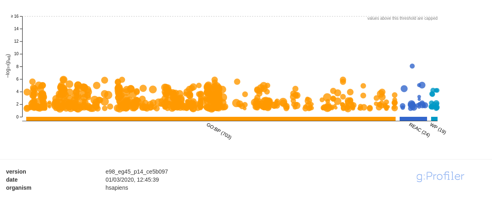
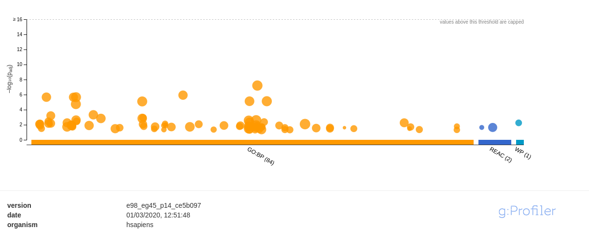
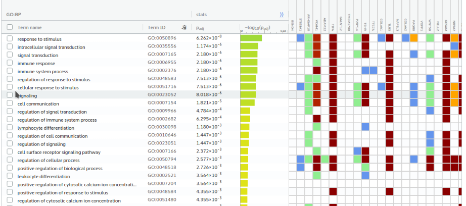

__Notes for compile:__ The "data" folder and A2.bib file should be placed in the same directory of Rmd file in oreder for Rmd file to compile.

__Acknowledgement__: Most of the R codes in this report are adapted from lecture notes, authored by BCB420 Instructor Ruth Isserlin. 

# 1. Introduce data and background from assignment 1
In assignment 1, I chose the data Series [GSE109161](https://www.ncbi.nlm.nih.gov/geo/query/acc.cgi?acc=GSE109161), data from an experiment about chimeric antigen receptor ligation transcriptional changes. The original paper is [@salter2018phosphoproteomic](https://www.ncbi.nlm.nih.gov/pmc/articles/PMC6186424/).

The downloaded supplementary data include 18794 rows of symbols and 24 samples. To regenerate data set from assignment 1, use the following codes:


```{r, message=FALSE}
library(GEOquery)
library(edgeR)

sfiles = getGEOSuppFiles('GSE109161')

car_exp = read.csv(rownames(sfiles),header=TRUE,stringsAsFactors=FALSE)
colnames(car_exp)[1] <- "hgnc_symbol"
cpms = cpm(car_exp[,2:25])
rownames(cpms) <- car_exp[,1]
keep = rowSums(cpms >1) >=3
car_exp_filtered = car_exp[keep,]
head(car_exp_filtered)
filtered_data_matrix <- as.matrix(car_exp_filtered[,2:25])
rownames(filtered_data_matrix) <- car_exp_filtered[,1]

```

The main idea of this experiment is that different kinds(4-1BB/CD3z vs CD28/CD3z) of CAR(chimeric antigen receptors) modified T cells differentiate in gene expression, which would affect efficacy and toxicity when used for treatment for B cell malignancies.

# 2. Sample groups

The data samples are obtained according to the experiment idea and design. The 24 columns in the data are from 24 samples(3 replicates * 2 time points * 2 samples for CD28/CD3z and control * 2 samples for 4-1BB/CD3z and control).

Based on the experiment design, I group the samples as follows:
```{r}
samples <- data.frame(lapply(colnames(filtered_data_matrix)[1:24],
                             FUN=function(x){unlist(strsplit(x, split = "\\_"))[c(2,3,4)]}))

colnames(samples) <- colnames(filtered_data_matrix)[1:24]
rownames(samples) <- c("CAR_type", "time_point", "stim_ctrl")
samples <- t(samples)
head(samples)
```

The "stim_ctrl" column specify stimulated or control cells samples, the "CAR_type" column specify which CAR type used for stimulation. But actually A42 and A44 belong to same type "4-1BB/CD3z", A43 and A45 belong to same type "CD28/CD3z", I changed the sample group accordingly.

```{r}
samples[samples[,"CAR_type"] =="A42",1]="4-1BB/CD3z"
samples[samples[,"CAR_type"] =="A44",1]="4-1BB/CD3z"
samples[samples[,"CAR_type"] =="A43",1]="CD28/CD3z"
samples[samples[,"CAR_type"] =="A45",1]="CD28/CD3z"
samples <- as.data.frame(samples)
head(samples)
```


# 3. T-test and MA plot

## 3.1 T-test
If we are interested in whether genes expressed differentially for two CAR types, we can do a simple T-test. 

```{r}

cartype1 <- rownames(samples[samples$CAR_type=="4-1BB/CD3z",])
cartype2 <- rownames(samples[samples$CAR_type=="CD28/CD3z",])
type1data <- filtered_data_matrix[,cartype1]
type2data <- filtered_data_matrix[,cartype2]

t.test(type1data,type2data)
```

The t-test shows genes in general are not significantly differentially expressed. But after normalizing data, and do the test again: 

```{r}
d = DGEList(counts=filtered_data_matrix, group=samples$CAR_type)
d = calcNormFactors(d)
normalized_count_data <- cpm(d)

type1data <- normalized_count_data[,cartype1]
type2data <- normalized_count_data[,cartype2]

t.test(type1data,type2data)

```

Now the result is significant for two CAR types comparison, this shows normalization indeed have effect on analysis result.

Across all genes expression significantly different in general, but we are more interested in some genes that are differentially expressed. 

For example IFNG gene is mentioned in the paper, I tested specific for this gene.

```{r}
gene_of_interest <- which(car_exp_filtered$hgnc_symbol ==
                            "IFNG")
IFNG_1 <- normalized_count_data[gene_of_interest, cartype1]
IFNG_2 <- normalized_count_data[gene_of_interest, cartype2]
t.test(IFNG_1,IFNG_2)
```

The gene was mentioned in the paper "CD28/CD3z CAR stimulation initiated more marked early transcriptional changes with greater fold increases in the expression", but from t-test perspective, it didn't reach exactly the 0.05 threshold.

ST8SIA1 gene on other hand, is quite significant.

```{r}
gene_of_interest <- which(car_exp_filtered$hgnc_symbol ==
                            "ST8SIA1")
ST8SIA1_1 <- normalized_count_data[gene_of_interest, cartype1]
ST8SIA1_2 <- normalized_count_data[gene_of_interest, cartype2]
t.test(ST8SIA1_1,ST8SIA1_2)
```

The varied expression across all genes can be seen visually by dispersion plot in section 5.2 of this report. Below in section 3.2 I compare the differential expression for two samples.
  

## 3.2 MA plot

From the MA plot we can have a quick look at how some genes differentially expressed for different CAR type samples. 
```{r}
plotMA(log2(filtered_data_matrix[,c(1,3)]), ylab="M - ratio log expression",
       main="MAplot two CARtype compare")
```

The above plot picked a sample from 4-1BB/CD3z group and a sample from CD28/CD3z group. The plot shows the mean log-expression of both samples are in normal range, and the M-ratio shows that quite many genes expressed differentially as not all points hugged in zero line. Some of the genes upregulated, some downrugulated. 

The plot drawn from two samples is a quick peek at how many genes might involved in differential expression.

# 4. MDS plot

The above MAplot compare just two samples. The MDS plot can visualize sample data distances across whole groups.

```{r}


plotMDS(d, labels=rownames(samples),
        col = c("darkgreen","blue")[factor(samples$stim_ctrl)], cex=0.5)
```

The above plot is based on stimulate-control group division, and groups are clearly cluster together in the plot, indicating clear difference between stimulate and control groups.

But the main idea of the experiment is: is there difference between different CAR types? So I plot according to CAR_type:

```{r}
plotMDS(d, labels=rownames(samples),
        col = c("darkgreen","blue")[factor(samples$CAR_type)], cex=0.5)
```

The plot is more subtle, needs further analysis. In section 5 I intended to find out how many genes are significantly differentially expressed induced by different CAR type.

The time points difference also apparent in the MDS plot.

```{r}
plotMDS(d, labels=rownames(samples),
        col = c("yellow","red")[factor(samples$time_point)], cex=0.5)
```

In this plot all control groups hug the top left corner, while all stimulated samples of 24 hours clustered in top right corner, all stimulated 6 hours samples in bottom right corner.

# 5. Calculate P-Values and dispersion plot, mean-variance plot

## 5.1 P-values

For this analysis I chose the 0.05 significant threshold as this is the common standard. For multiple hypotheses testing used Benjamni-Hochberg threshold, also very common, less stringent than Bonferroni correction.

In first analysis model design is based on stimulate-control compare.
```{r}
minimalSet <- ExpressionSet(assayData=normalized_count_data)

model_design_stim <- model.matrix(
  ~ samples$stim_ctrl)

fit_stim <- lmFit(minimalSet, model_design_stim)
fit2_stim <- eBayes(fit_stim,trend=TRUE)
topfit_stim <- topTable(fit2_stim,
                       coef=ncol(model_design_stim),
                       adjust.method = "BH",
                       number = nrow(normalized_count_data))
output_hits_stim <- merge(normalized_count_data[,1],
                         topfit_stim,by.y=0,by.x=1,all.y=TRUE)
#sort by p-value
output_hits_stim <- output_hits_stim[order(output_hits_stim$P.Value),]
output_hits_stim[1:10,]
length(which(output_hits_stim$P.Value < 0.05))
length(which(output_hits_stim$adj.P.Val < 0.05))
```

Thousands of rows P-values, not only passed 0.05 threshold, but also passed the multiple hypothesis standard Benjamni-Hochberg threshold. The result is clearly significant.

Then again we are interested in CAR type samples compare. I need model design based on combination of CAR_type and stim_ctrl.

```{r}
model_design_comb <- model.matrix(
  ~ samples$stim_ctrl + samples$CAR_type)
fit_comb <- lmFit(minimalSet, model_design_comb)
fit2_comb <- eBayes(fit_comb,trend=TRUE)
topfit_comb <- topTable(fit2_comb,
                        coef=ncol(model_design_comb),
                        adjust.method = "BH",
                        number = nrow(normalized_count_data))
output_hits_comb <- merge(normalized_count_data[,1],
                          topfit_comb,by.y=0,by.x=1,all.y=TRUE)

output_hits_comb <- output_hits_comb[order(output_hits_comb$P.Value),]
length(which(output_hits_comb$P.Value < 0.05))
length(which(output_hits_comb$adj.P.Val < 0.05))
```

This time 851 genes passed 0.05 P-value threshold but none pass the Benjamni-Hochberg multiple hypothesis test standard. I tried (maybe more stringent) Benjamini-Yekutieli standard and the result was the same. 

This means the expression difference of two CAR types sample are some what significant but failed to pass multiple hypothesis testing. My thinking is the BH or BY standard maybe too stringent to pass. The difference in expression can be seen clearly by the following heatmap in section 6. 

If add time points factor, then the diffenrence is more signifcant.
```{r}
model_design_time <- model.matrix(~ samples$stim_ctrl 
                                  + samples$CAR_type + samples$time_point)
fit_time <- lmFit(minimalSet, model_design_time)
fit2_time <- eBayes(fit_time,trend=TRUE)
topfit_time <- topTable(fit2_time,
                        coef=ncol(model_design_time),
                        adjust.method = "BH",
                        number = nrow(normalized_count_data))
output_hits_time <- merge(normalized_count_data[,1],
                          topfit_time,by.y=0,by.x=1,all.y=TRUE)

output_hits_time <- output_hits_time[order(output_hits_time$P.Value),]
length(which(output_hits_time$P.Value < 0.05))
length(which(output_hits_time$adj.P.Val < 0.05))
```

This time also passed the Benjamni-Hochberg standard. Meaning the CAR type difference is significant if compounding diffenrent time points. For example, the paper mentioned early stage difference of expression induced by CD28/CD3z.


## 5.2 Dispersion plot and mean-variance plot
Based on above model I can draw a gene dispersion plot.

```{r}
d <- estimateDisp(d, model_design_comb)
plotBCV(d, col.tagwise = "black", col.common = "red")
```

The plot shows the gene expression is highly variable relative to the mean among samples. A lot of dots(genes) highly expressed and have high variance.

```{r}
plotMeanVar(d, show.raw.vars = TRUE, show.tagwise.vars=TRUE,
            show.ave.raw.vars = TRUE,
            NBline=TRUE,
            show.binned.common.disp.vars = TRUE)
```

The plot shows highly expressed genes tend to have high variance.

# 6. Heatmap

Heatmap for all data has too high computational load when perform distance calculation for cluster, actually we only interested in genes with significant p-values. Here I build a heatmap out of rows in tophits from combination of CAR_type and stim_ctrl model .  

```{r, message=FALSE}
library(ComplexHeatmap)
library(circlize)
heatmap_matrix <- normalized_count_data[,2:ncol(normalized_count_data)]
rownames(heatmap_matrix) <- rownames(normalized_count_data)
colnames(heatmap_matrix) <- colnames(normalized_count_data[,2:ncol(normalized_count_data)])

top_hits <- output_hits_comb$x[output_hits_comb$P.Value<0.05]
top_hits[1:10]

heatmap_matrix_tophits <- t(
  scale(t(heatmap_matrix[
    which(rownames(heatmap_matrix) %in% top_hits),])))

if(min(heatmap_matrix_tophits) == 0){
  heatmap_col = colorRamp2(c( 0, max(heatmap_matrix_tophits)),
                           c( "white", "red"))
} else {
  heatmap_col = colorRamp2(c(min(heatmap_matrix_tophits), 0,
                             max(heatmap_matrix_tophits)), c("blue", "white", "red"))
}
    
current_heatmap <- Heatmap(as.matrix(heatmap_matrix_tophits),
                           cluster_rows = TRUE,
                           cluster_columns = TRUE,
                           show_row_dend = TRUE,
                           show_column_dend = TRUE,
                           col=heatmap_col,
                           show_column_names = TRUE,
                           show_row_names = FALSE,
                           show_heatmap_legend = TRUE,
                           row_title = "genes",
                           column_title = "samples"
) 
current_heatmap
```

The heatmap pattern is obvious to human brain, moreover, from the clustered columns we can see stimulated samples cluster together(all on the left half, columns with "stim" label), control samples cluster together(all on right side, columns with "ctrl" label). 

Also rows cluster together, indicating some groups of genes upregulated(red block) in stimulated group but the same genes downregulated(blue block) in control group, some genes downregulated in stimulated group but the same genes upregulated in control group.

But the two CAR type samples devide is not so obvious, some A45 and A43 CARs( the 41BB/CD3z type) cluster together on left side, but some A43 and A45 clutser together with A44(CD28/CD3z type). 

I need another heatmap that contrast the two CAR types samples, this heatmap will not cluster on colums but put same CAR type columns together.

```{r}

heatmap_matrix <- cbind(normalized_count_data[,cartype1],normalized_count_data[,cartype2])

heatmap_matrix_tophits <- t(
  scale(t(heatmap_matrix[
    which(rownames(heatmap_matrix) %in% top_hits),])))

if(min(heatmap_matrix_tophits) == 0){
  heatmap_col = colorRamp2(c( 0, max(heatmap_matrix_tophits)),
                           c( "white", "red"))
} else {
  heatmap_col = colorRamp2(c(min(heatmap_matrix_tophits), 0,
                             max(heatmap_matrix_tophits)), c("blue", "white", "red"))
}

current_heatmap <- Heatmap(as.matrix(heatmap_matrix_tophits),
                           cluster_rows = TRUE,
                           cluster_columns = FALSE,
                           show_row_dend = TRUE,
                           show_column_dend = TRUE,
                           col=heatmap_col,
                           show_column_names = TRUE,
                           show_row_names = FALSE,
                           show_heatmap_legend = TRUE,
                           row_title = "genes",
                           column_title = "Left: 4-1BB/CD3z samples; Right: CD28/CD3z  samples"
) 
current_heatmap
```

Patterns on this heatmap is more subtle. Although clearly columns contrast each other, indicating samples generally differ each other, with blue-lighter control samples interlased with red-darker simulated samples. 

The 4-1BB/CD3z samples on the left generally blue-lighter, the right CD28/CD3z samples are generally red-darker, althought contrast is not too strong. 

Meaning the CD28/CD3z samples induce relatively higher expression, this is consistant with the data summary of series GSE109161 that states "CD28/CD3z CAR stimulation initiated more marked early transcriptional changes with greater fold increases in the expression". 

Another way to group samples is according to time points. The below heatmap put all 12 control samples on the left, then the 12 stimulated samples devided in two groups: 6 hour and 24 hours.

```{r}
ctrl_col <- rownames(samples[samples$stim_ctrl=="ctrl",])
ctrl_sample <- filtered_data_matrix[, ctrl_col]
type1_6hr <- rownames(samples[samples$time_point=="6hr" & samples$CAR_type =="4-1BB/CD3z" 
                              & samples$stim_ctrl == "stim",])
type1_6hr_sample <- filtered_data_matrix[, type1_6hr]
type1_24hr <- rownames(samples[samples$time_point=="24hr" & samples$CAR_type =="4-1BB/CD3z" 
                              & samples$stim_ctrl == "stim",])
type1_24hr_sample <- filtered_data_matrix[, type1_24hr]
type2_6hr <- rownames(samples[samples$time_point=="6hr" & samples$CAR_type =="CD28/CD3z" 
                              & samples$stim_ctrl == "stim",])
type2_6hr_sample <- filtered_data_matrix[, type2_6hr]
type2_24hr <- rownames(samples[samples$time_point=="24hr" & samples$CAR_type =="CD28/CD3z" 
                               & samples$stim_ctrl == "stim",])
type2_24hr_sample <- filtered_data_matrix[, type2_24hr]
heatmap_matrix <- cbind(ctrl_sample, type1_6hr_sample, type2_6hr_sample, type1_24hr_sample, type2_24hr_sample)

heatmap_matrix_tophits <- t(
  scale(t(heatmap_matrix[
    which(rownames(heatmap_matrix) %in% top_hits),])))
 
heatmap_matrix_tophits[is.na(heatmap_matrix_tophits)] <- 0 
if(min(heatmap_matrix_tophits) == 0){
  heatmap_col = colorRamp2(c( 0, max(heatmap_matrix_tophits)),
                           c( "white", "red"))
} else {
  heatmap_col = colorRamp2(c(min(heatmap_matrix_tophits), 0,
                             max(heatmap_matrix_tophits)), c("blue", "white", "red"))
}

current_heatmap <- Heatmap(as.matrix(heatmap_matrix_tophits),
                           cluster_rows = TRUE,
                           cluster_columns = FALSE,
                           show_row_dend = TRUE,
                           show_column_dend = TRUE,
                           col=heatmap_col,
                           show_column_names = TRUE,
                           show_row_names = FALSE,
                           show_heatmap_legend = TRUE,
                           row_title = "genes",
                           column_title = "12 control samples, 6hr samples, 24hr samples"
) 
current_heatmap
```

This heatmap reveals another aspect: regardless CAR type, 6 hours samples show similarty with 6 hours groups, as are 24hours groups. But different genes expressed in 6 hours group than that of 24 hours.  

# 7. Thresholded over-representation analysis

The heatmap visually indicating groups of genes upregulated or downregulated, this section is to find out which of the genes over-representated and involved in which of the pathways or biological processes.

## 7.1 Find over-representated genes

```{r}
d = DGEList(counts=filtered_data_matrix, group=samples$CAR_type)
d <- estimateDisp(d, model_design_comb)
d <- calcNormFactors(d)
fit <- glmQLFit(d, model_design_comb)
qlf.cartype <- glmQLFTest(fit, coef='samples$CAR_typeCD28/CD3z')
qlf_output_hits <- topTags(qlf.cartype,sort.by = "PValue",
                           n = nrow(filtered_data_matrix))
length(which(qlf_output_hits$table$PValue < 0.05))
length(which(qlf_output_hits$table$FDR < 0.05))
topTags(qlf.cartype)

length(which(qlf_output_hits$table$PValue < 0.05
             & qlf_output_hits$table$logFC > 0))
length(which(qlf_output_hits$table$PValue < 0.05
             & qlf_output_hits$table$logFC < 0))

qlf_output_hits_withgn <- merge(car_exp[,1],qlf_output_hits,
                                by.x=1, by.y = 0)
qlf_output_hits_withgn[,"rank"] <- -
  log(qlf_output_hits_withgn$PValue,base =10) *
  sign(qlf_output_hits_withgn$logFC)
qlf_output_hits_withgn <-
  qlf_output_hits_withgn[order(qlf_output_hits_withgn$rank),]
upregulated_genes <- qlf_output_hits_withgn$x[
  which(qlf_output_hits_withgn$PValue < 0.05
        & qlf_output_hits_withgn$logFC > 0)]

downregulated_genes <- qlf_output_hits_withgn$x[
  which(qlf_output_hits_withgn$PValue < 0.05
        & qlf_output_hits_withgn$logFC < 0)]

write.table(x=upregulated_genes,file=("./data/car_upregulated_genes.txt"),sep = "\t",
            row.names = FALSE,col.names = FALSE,quote = FALSE)

write.table(x=downregulated_genes,
            file=("./data/car_downregulated_genes.txt"),sep = "\t",
            row.names = FALSE,col.names = FALSE,quote = FALSE)
```

The above code shows number of upregulated and downregulated genes are on roughly the same scale. The result genes are separately stored in list files.

## 7.2 MA plot

Plot the above result in MA plot:

```{r}
up <- qlf.cartype[which(qlf.cartype$table$PValue < 0.05 & qlf.cartype$table$logFC > 1),]
down <- qlf.cartype[which(qlf.cartype$table$PValue < 0.05
                              & qlf_output_hits$table$logFC < -1),]

plot(qlf.cartype$table$logCPM, qlf.cartype$table$logFC, cex = .5, main = "CAR type MA plot", xlab = "LogCPM",ylab = "LogFC")
points(up$table$logFC, cex = .5, col = "red")
points(down$table$logFC, cex = .5, col = "blue")


```


## 7.3 Over-representation analysis using g:Profiler

I used g:Profiler for this report. Choose this tool because its friendly interfaces and I have already familiar with it. It data sources includes the most sources we are interested and the data are regularly updated and curated.

The process of inquiry:

*In g:Profiler web service, upload the gene list(upregulated and downregulated genes separately).

*In data sources option select the three sources GO:BP, Reactome, Wikipathway. Choose these annotations because I am seeking the biological processes or pathways the selected genes are involved, terms like cellular component and molecular function not relevant.  

*In "Significance threshold " select "Benjamini-Hochberg FDR"

*Run query, some genes matched to multiple ensemble ID, use option: "select the Ensembl IDs with the most GO annotations", rerun query.

### Upregulated genes results

Downloaded png for visualized upregulated genes result: 

Screenshot for upregulated genes result:


Table generated from downloaded csv file, top results for three data resources:

```{r}
upregulated_result = read.csv("./data/gProfiler_up.csv",header=TRUE,stringsAsFactors=FALSE)

library(knitr)
kable(upregulated_result[c(1:10,704:714,729:738),1:8], type="html")
```

### Downregulated genes results
Downloaded png for visualized downregulated genes result:

Screenshot for downregulated genes result:


Table generated from downloaded csv file, top results for three data resources:

```{r}
downregulated_result = read.csv("./data/gProfiler_down.csv",header=TRUE,stringsAsFactors=FALSE)

library(knitr)
kable(downregulated_result[c(1:10,85:87),1:8], type="html")
```

# 8. Interpretation

__1. Stimulated vs control(rest cell) samples comparison__

The two groups expression difference is significant and obvious seen from P-values and heatmap.

__2. Two CAR type 4-1BB/CD3z vs CD28/CD3z samples comparison__

From P-value calculation, heatmap, MDS plot, the difference of expression of two CAR type samples, is not very clear. But the T-test for the two groups data is significant. 

P-values  calculation in section 5 of two CAR type compare result in 851 genes pass the 0.05 threshold but none pass Benjamni-Hochberg standard. But if taking into account time points, thousands of genes p-values are significant even after multiple hypothesis test.

The second heatmap in section 6, indicating CD28/CD3z samples induce more expression of some genes, consistant with the original paper.


__3. The top enrichment analysis results, are the results expected?__

By the description of the paper, chimeric antigen receptor modify T cells to recognize cancer cells in order to attack tumour. In the process CAR linking an antigen recognition domain to T cell signalling modules comprised of CD3z to provide signal, and CD28 or 4-1BB to provide costimulation. Looking from this perspective, the top list of pathways related to upregulated genes are all related to the CAR function:

leukocyte chemotaxis, cell surface receptor signaling pathway, regulation of T cell activation, leukocyte cell-cell adhesion, regulation of leukocyte cell-cell adhesion, T-Cell antigen Receptor (TCR) pathway during Staphylococcus aureus infection.

So the results for upregulated genes are highly expected.

For the downregulated genes, the top pathway list include:

Response to stimulus, intracellular signal transduction, signal transduction, immune response, immune system process,etc.

These are roughly related to stimulation in immune cells, but maybe not specifically expected or designed for CAR production. It's possible they are related to side effect or toxicity of the CAR treatment, and seeking these over-representation results is one purpose of this experiment.

__4. Do the over-representation results support conclusions or mechanism discussed in the original paper?__

In this assignment I focused on what can be directly showed from the data, and whole groups comparison, the paper was seeking more detailed comparison of specific genes in order to find genes related to efficacy and toxicity of CAR treatment.

The results of this assignment support the conclusion of the original paper in general, as I see the over-representated genes involve processes or pathways related to the effect of CAR treatment, but the paper has more detailed study of specific genes.

__5. Other publications that support some of my results__

CAR ligation modified T cells described in another paper [@henderson2013chimeric], the CAR ligation produced the cytokines IFN-γ, IL-2, IL-4, IL-10, TNF-α and IL-17.

In my analysis I found the similar results, the report in the above paper surport my finding. For example IL2 was among upregulated gene list, and the result is significant:

```{r}
qlf_output_hits_withgn[qlf_output_hits_withgn$x=="IL2",]
qlf_output_hits_withgn[qlf_output_hits_withgn$x=="IL4",]
qlf_output_hits_withgn[qlf_output_hits_withgn$x=="IL10",]
qlf_output_hits_withgn[qlf_output_hits_withgn$x=="TNF",]
```
Another paper [@cheadle2012ligation] also had the same finding about IL2.


# References


