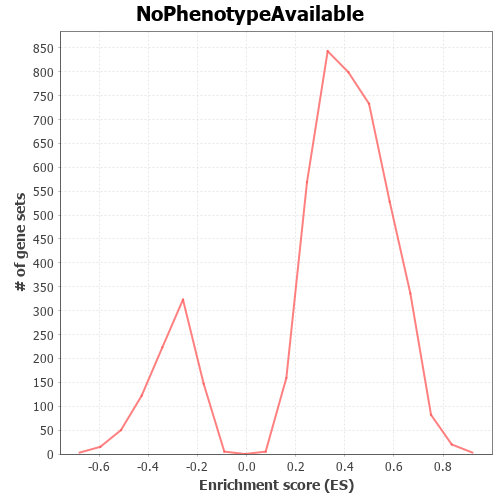
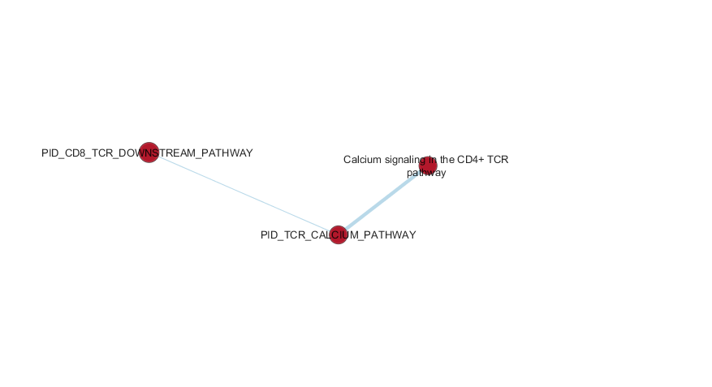

# 1. Introduce data and background from assignment 1 and 2
In assignment 1, I choosed the data Series [GSE109161](https://www.ncbi.nlm.nih.gov/geo/query/acc.cgi?acc=GSE109161), data from an experiment about Chimeric Antigen Receptor (CAR) ligation transcriptional changes. The original paper is listed in "References"[@salter2018phosphoproteomic , https://www.ncbi.nlm.nih.gov/pmc/articles/PMC6186424/].

The downloaded supplmentary data include 18794 rows of symbols and 24 samples. In Assignment 1 I filtered weakly expressed features as well as rows that don't match any HGNC symbols and then performed nomrlization. In Asignment 2 I defined the sample columns and desiged models.

Assignment 1 and 2 reports are included as child documents at the end of this report.

To reload the filtered result from Assignment 1: 
```{r}

car_exp_filtered <- read.csv("./data/result.csv",header=TRUE,stringsAsFactors=FALSE)
dim(car_exp_filtered)
```

The 24 columns in the data are from 24 samples(3 replicates * 2 time points * 2 samples for CD28/CD3$\zeta$ and control * 2 samples for 4-1BB/CD3$\zeta$ and control). Both  CD28/CD3$\zeta$ and 4-1BB/CD3$\zeta$ samples are CAR stimulated samples only with two different CAR types.

In order for this notebook to compile, I 'll repeat a few codes in Assignment 2 to define sample and model design. 

```{r}
filtered_data_matrix <- as.matrix(car_exp_filtered[,2:25])
rownames(filtered_data_matrix) <- car_exp_filtered[,1]
samples <- data.frame(lapply(colnames(filtered_data_matrix)[1:24],
                             FUN=function(x){unlist(strsplit(x, split = "\\_"))[c(2,3,4)]}))

colnames(samples) <- colnames(filtered_data_matrix)[1:24]
rownames(samples) <- c("CAR_type", "time_point", "stim_ctrl")
samples <- t(samples)
samples[samples[,"CAR_type"] =="A42",1]="4-1BB/CD3z"
samples[samples[,"CAR_type"] =="A44",1]="4-1BB/CD3z"
samples[samples[,"CAR_type"] =="A43",1]="CD28/CD3z"
samples[samples[,"CAR_type"] =="A45",1]="CD28/CD3z"
samples <- as.data.frame(samples)
model_design_stim <- model.matrix(
  ~ samples$stim_ctrl)

```

# 2. Non-thresholded Gene set Enrichment Analysis

## 2.1 Perform GSEA
Assignment 2 prodcued upregulated and downregulated list by thresghold method, here use non-threshold method to produce ranked gene list.

```{r,message=FALSE}
library(edgeR)
d = DGEList(counts=filtered_data_matrix, group=samples$stim_ctrl)
d <- estimateDisp(d, model_design_stim)
fit <- glmQLFit(d, model_design_stim)
qlf.stim <- glmQLFTest(fit)
rankstim <- topTags(qlf.stim,sort.by = "logFC",
                    n = nrow(filtered_data_matrix))
rankstim <- data.frame(genes=row.names(rankstim),rankstim)
```

The above code used "model_design_stim", which contrast the samples marked as stimulated, to samples marked as control.

To define the "rank" column, I based rank on the logFC value as differential statistics.

```{r}
rankstim$rank <- rankstim$logFC
rankstim <- rankstim[order(-rankstim$rank),]
rankstim <- rankstim[,c(1,7)]
head(rankstim)
tail(rankstim)
write.table(x=rankstim,file=("./data/carrankstim.rnk"),sep = "\t",
            row.names = FALSE,col.names = TRUE,quote = FALSE)
```

The rank file "carrankstim.rnk" is created as above, prepared as Preranked GSEA input.

At the top of this rank file are genes with greatest positive fold change for stimulated samples relative to control samples. At the bottom of this file are genes with greatest (absolute value) negative fold change for stimulated samples relative to control samples.

I used GSEA java GUI application (v4.0.3) running on my local machine to perform Non-thresholded Gene set Enrichment Analysis. Used Preranked GSEA procedure, use the above carrankstim.rnk as rank list, used bader lab current version with GO biological process: "Human_GOBP_AllPathways_no_GO_iea_March_01_2020_symbol.gmt" as gene set file. Parameters for running include: "Number of permutations, 1000", "No_collaps to gene symbol", "Max size for gene sets, 200", "min size for gene sets, 15".

The running of GSEA took approximately 5 minutes. 

Listed below is the report summarize:

**GSEA Report for Dataset carrankstim**

**Enrichment in phenotype: na**  
4077 / 4965 gene sets are upregulated in phenotype na_pos  
2265 gene sets are significant at FDR < 25%  
1296 gene sets are significantly enriched at nominal pvalue < 1%  
1794 gene sets are significantly enriched at nominal pvalue < 5%  

**Enrichment in phenotype: na**  
888 / 4965 gene sets are upregulated in phenotype na_neg  
61 gene sets are significantly enriched at FDR < 25%  
50 gene sets are significantly enriched at nominal pvalue < 1%  
111 gene sets are significantly enriched at nominal pvalue < 5%  

**Dataset details**  
The dataset has 12815 features (genes)  
No probe set => gene symbol collapsing was requested, so all 12815 features were used  

**Gene set details**  
Gene set size filters (min=15, max=200) resulted in filtering out 13440 / 18405 gene sets  
The remaining 4965 gene sets were used in the analysis  

**Global statistics and plots**  
Plot of p-values vs. NES  
  
Global ES histogram  
  

The whole report was uploaded and can be seen from this [link](./data/my_analysis.GseaPreranked.1585669102086/index.html){target="_blank"}.

## 2.2 Interpret the result

**Phenotype** Phenotype is not available because as the assignment required, here I performed the Preranked GSEA, which does not specify phenotype in input. Only standard GSEA need a class file to specify phenotype for every column of samples. However, the rankfile was based on my model design which specified the 
phenotypes "stim" and "ctrl" for every samples, rank was calculated as fold change of stimulated samples vs control samples. 

**Main metrics of GSEA**  
GSEA is actually a statistical test on whether the gene sets are significantly  overrepresented on the top or bottom of the rank list. Specifically it used Kolmogorov–Smirnov statistics.

**Postive ES(NES)** gene sets with positive ES and NES values are those correspond to (overrepresented in) genes at the top of the rank file, which are genes with postive fold change of stimulated samples vs control samples .

**Negative ES(NES)** gene sets with negative ES and NES values are those correspond to (overrepresented in) genes at the bottom of the rank file, which are genes with negative fold change of stimulated samples vs control samples .

**NES** normalized ES so accounts for differences in gene set size and in correlations between gene sets and the rank list. To normalize GSEA needs permutation, for preranked GSEA permutation can only use gene sets permutation because no phenotype available.

**FDR** is the false discovery rate, FDR is adjusted for gene set size and multiple hypotheses testing while the nominal p-value is not. So for choosing the significant gene sets we need both thresholds.

**Global staistics**  
The **p-values vs. NES plot** shows there are plenty of gene sets with smaller than 1% nominal p-values, but for building enrichment map I decided to take  more stringent theshold, only look into smaller than 0.005 p-values gene sets. The 25% FDR threshold was marked as yellow on the plot. We can see there are enough gene sets satisfy both FDR 25% and p-value 0.005 thresholds, but the gene sets with negative NES that satisfy both thresholds are much less, because their FDR values are higher on average.  
The **Global ES histogram** showes there are less gene sets with negative ES than with postive ES.   
Combining results from the two plots we can predict there will much less gene sets with nagtive NES satify thresholds.

**Representative gene sets**  
**Positive NES**  
"4077 / 4965 gene sets are upregulated in phenotype na_pos", are those gene sets with postive NES, on top of this list is "HALLMARK_E2F_TARGETS%MSIGDB_C2%HALLMARK_E2F_TARGETS", which is a gene set contends 200 genes related to cell cycle control. 

According to the Gene set enrichment paper [@Subramanian15545 https://www.pnas.org/content/102/43/15545], "The leading-edge subset can be interpreted as the core of a gene set that accounts for the enrichment signal". The above gene set has 149 genes listed as "CORE ENRICHMENT" genes, so should be intepreted as leading edge genes, which comprise majority of the 200 genes in the gene set. If we look at the enrichemnt plot of this gene set, then these genes correspond to genes in the ranked list prior to the peak score.   
  

**Negatice NES**  
"888 / 4965 gene sets are upregulated in phenotype na_neg" are those gene sets with negative NES, on top of this list is:"CILIUM MOVEMENT%GOBP%GO:000334".This is a gene set with only 18 genes related to cilium movement.  
Since the size of this gene set is small I manually checked all the genes in the gene set. All except one(OFD1) of them are in the rank list and mostly with negative rank, clearly the gene set is overrepresented in the bottom of the rank list even account for the small size.  
14 genes out of 18 listed as "CORE ENRICHMENT" genes comprise the leading edge genes. In the enrichment plot of this gene set:  


these genes correspond to genes that appear subsequent to the peak score.

**Compare to the results from the thresholded analysis in Assignment #2**  
Even though in both analysis I used GO:BP as gene sets(the version through g:profiler and Bader lab, respectively):  
There is no overlap in Top 10 positive NES group with the top 10 upregulated gene sets of assignment 2.  
There is no overlap in Top 10 negative NES group with the top 10 downregulated gene sets of assignment 2.  
**Is this a straight forward comparison?**  
No, there are three reasons:  
1, The threshold analysis in assignment 2 used only part of the genes(p-value < 0.05) in the data for gene set overrepresentation test, whereas the non-threshold analysis in this assignment used all the genes for overrepresentation test. So genes with greater p-values can influence the result.   
2, The threshold analysis only test gene set overrepresented or not so Fisher's test is enough, whereas the non-threshold analysis in this assignment test whether some gene set overrepresented in the top and some gene set overrepresented in bottom of the ranklist. The test is Kolmogorov–Smirnov test, and the rank list is fold change rank. The fold change rank is not included threshold analysis, which only consider fold change is postive or negative.  
3, I used "model_design_comb" result for the threshold analysis in assignment 2, which combined stimulation vs control and two CAR type in the samples for model. Here in assignment3 I only used stimulation vs control as model.  

Thereshold analysis and non-threshold analysis both have pros and cons, from the point of view of top 10 list of result, threshold analysis result found out pathways clearly related to T cell receptor activities while non-threshold analysis still have those patheways picked out (I will show in enrichment map part) but not in top 10.  

So this is an example that threshold analysis may quick at pick the top pathways, but non-threshold analysis may good at paint a more complete picture.

Reference:[@Reimand2019].

# 3 Enrichment map in Cytoscape

## 3.1 Initial enrichment map
I created the enrichment map using GSEA and Cytoscape (Version: 3.7.2) application running on my local computer.  

The GSEA result named "my_analysis.GseaPreranked.1585669102086" is checked in github data directory.

I loaded this result as auotmaticaly named dataset "dataset 1" (this name can't be changed and carried to cytoscape legend). Enrichment map parameters were: P-value Cutoff: 0.005, FDR Q-value Cutoff: 0.1, Similarity cutoff: overlap coefficient. These parameters already can generate rich and interesting nodes and edges in map, so I don't have to loose any threshold.

The cretated enrichment map before any manual adjustment:  

  

The number of number of nodes and edges can be seen on Cytoscape network panel in control panel. there are 1163 nodes and 18198 edges.  
From the map we can see predominently red nodes and very few blue nodes. The colors were illustrated by the legend produced by cytoscape:  


The colors are showing the NES values of the nodes, positive NES nodes painted red, negative NES nodes painted blue. As predicted in section 2, only few nodes with negative NES passed the 0.005 pe-value and 25% FDR thresholds, the main limiting factor is FDR. The following figures used Cytoscape app "legend Creator" to add legend.

From the map we can see many gene sets are significantly overrepresented in genes at the top of rank list, which are upregulated genes in stimulated samples compared to controls, but only a few gene sets are significantly overrepresented in genes at the bottom of rank list, which are downregulated genes in stimulated samples compared to controls. This shows the experiment captured mostly an expression profile more focused on upregulated genes.

The map contains big clustes of densly connected nodes, as well as sparsly connected nodes or singlgtons. It integrated so rich informations, a closer look at part of the network before manual work:  

 

But I have to focus on themes related to the experiment and original paper, they are inside the network as the overlaped image above but nodes not intereted should cut off. So I decided to choose a subset of the network.

Since the experiment is about T cells, I used keyword "T cells" as search bar(top right corner) input, after searching selected nodes and edges, click "Select" drop menu to "Hide Unselected nodes and edges". 

On the resulting network I then add annotations.

## 3.2 Annotate enrichment map

First I used AutoAnnotate. After installed the app, I created new Annotation set using the following parametrs: 
"Annotate entire network"(it will not exceed 10 annotations anyway), checked "layout network to prevent cluster overlap", Advanced options choosed "Use clusterMaker App", Cluster algorithm choosed "MCL cluster", edge weight column choosed "similarity_coeffcient", label Column used "GS_DESCR", Label Algorithm USed "WordCloud:Adjacent Word(default)", "Max word per label:3", "Adjacent word bonus:8". 

This default parameters are pretuned for enrichment map so keep the defalut and trun out to works fine.

The resulting auto annoation before manual adjustment(Only moved the clusters closer):

 

The big cluster have many overlaps and the cluster name is not accurate, so I did some manual annotation adjustment. The result is the following figure:

 

The nodes inside the big cluster "T cell regulation/activation" are listed below:

REGULATION OF ACTIVATED T CELL PROLIFERATION%GOBP%GO:0046006  
REGULATION OF T CELL PROLIFERATION%GOBP%GO:0042129  
REGULATION OF T CELL DIFFERENTIATION%GOBP%GO:0045580  
REGULATION OF CD4-POSITIVE, ALPHA-BETA T CELL ACTIVATION%GOBP%GO:2000514  
REGULATION OF CD4-POSITIVE, ALPHA-BETA T CELL DIFFERENTIATION%GOBP%GO:0043370  
REGULATION OF ALPHA-BETA T CELL DIFFERENTIATION%GOBP%GO:0046637  
REGULATION OF REGULATORY T CELL DIFFERENTIATION%GOBP%GO:0045589  
REGULATION OF ALPHA-BETA T CELL ACTIVATION%GOBP%GO:0046634  
REGULATION OF T CELL CYTOKINE PRODUCTION%GOBP%GO:0002724  
REGULATION OF T-HELPER CELL DIFFERENTIATION%GOBP%GO:0045622  
POSITIVE REGULATION OF ALPHA-BETA T CELL ACTIVATION%GOBP%GO:0046635  
POSITIVE REGULATION OF ALPHA-BETA T CELL DIFFERENTIATION%GOBP%GO:0046638  
POSITIVE REGULATION OF CD4-POSITIVE, ALPHA-BETA T CELL ACTIVATION%GOBP%GO:2000516  
POSITIVE REGULATION OF T CELL ACTIVATION%GOBP%GO:0050870  
POSITIVE REGULATION OF T CELL DIFFERENTIATION%GOBP%GO:0045582  
NEGATIVE REGULATION OF T CELL PROLIFERATION%GOBP%GO:0042130  
NEGATIVE REGULATION OF T CELL ACTIVATION%GOBP%GO:0050868  
NEGATIVE REGULATION OF T CELL DIFFERENTIATION%GOBP%GO:0045581  

Many of the nodes connected with thick edges, indicating these gene sets overlap heavyly, and the gene sets are very similar to each other (I build the enrichment map using "overlap" as parameter for similarity coefficient). Since these pathways are very important and attracted great attention, researchers found many pathways from similar batch of genes.

The themes in this network are closely related to the effect to this experiment of Chimeric Antigen Receptor in genral, that is they modify the T cells receptor specificity. Some of the results in assgnment 2 are very similar for examle "regulation of T cell activation	GO:0050863". So the network generally agree with the descripitions in the original paper[@salter2018phosphoproteomic ], but the paper is not a complete enrichment analysis per se, it's focused on specific topics with clinic implications.

Reference: [@Merico2010].

# 4 Post analysis, using transcription factor

I created new network using the a subset of the original network, by deleting nodes and edges.
Deleted all nodes and edges that doesn't contain "T cell" by new column filter. Procedure is: click "Select" panel in control panel, click "+" to add new filter, use "Node: Formatted_name" as column selector, select "doesn't contain" from drop menu, and enter the keyword, and hit "Apply", then in main Edit dropmenu, select "Delete selected nodes and edges".

I downloaded "Human_TranscriptionFactors_MSigdb_March_01_2020_symbol.gmt" from Bader lab website to local machine.

To create sognature gene set, in the EnrichmentMap panel, click "add new Signature Gene Sets", used "Mann-Whitney (two-sided)" test with cutoff 0.05, 

Inspired by previous knowledge and from the paper prediction, I specifically selected transcription factor NFAT and FOXO4, which are known to be related to T cell and the experiment, deselect all other TFs.  If don't choose subset of the data in advance then computation will be slow and extreamly hard to use. The resulting network with minor manual adjustment is as follows:

 

The figures shows NFAT closely related to T cell activation and regulation. In the paper [@doi:10.1146/annurev.immunol.15.1.707] : "Proteins belonging to the NFAT (nuclear factor of activated T cells) family of transcription factors play a central role in inducible gene transcription during the immune response (1, 2, 3, 4). Despite their name, NFAT proteins are expressed not only in T cells, but also in other classes of immune-system cells". Here the genesets regulated by NFAT are all correspond to genes upregulated in CAR stimulated samples (showing red). 

The original paper of this experiment [@salter2018phosphoproteomic] described Krüppel-like
factor 2 (KLF2) and IL-7 receptor (IL7R), and "KLF2 and IL7R are associated with memory T cell formation and are targets of the FOXO family of transcription factors". This is consistent with the above figure that connected multiple gene sets with FOXO4 transcriptional factor. IL-7 receptor gene is upregulated, KLF2 is downregulated showing in the rank list file (These are two genes not gene sets).

# 5 A specific pathway: T Cell Receptor Signaling Pathway

At the focus of this experient and the paper is the pathway T cell receptor (TCR) signaling pathway. CAR works by engineering to modify the T cell receptor to give T cells the new ability to target a specific protein, so activation of T cells upon ligand binding depends on single-chain variable immunoglobulin fragment (scFv) fused to intracellular signaling domains.

T cell receptor signaling pathway had been intensely targeted in previous research. In this enrichment analysis, the Bader lab data contains multiple gene sets related to TCR, such as: "PID_TCR_CALCIUM_PATHWAY", "CALCIUM SIGNALING IN THE CD4+ TCR PATHWAY", "PID_CD8_TCR_DOWNSTREAM_PATHWAYY", "T-CELL ANTIGEN RECEPTOR (TCR) PATHWAY DURING STAPHYLOCOCCUS AUREUS INFECTION", "DOWNSTREAM TCR SIGNALING", "T-CELL ANTIGEN RECEPTOR (TCR) SIGNALING PATHWAY","TCR SIGNALING%REACTOME","BIOCARTA_TCR_PATHWAY".

From looking at theier names, we may guess these pathways have many overlaped genes, but If compare them directly by enrichment map, only 5 of them passed the pvalue 0.005 and FDR 0.1 thresholds, and only thick overlap exists between "CALCIUM SIGNALING IN THE CD4+ TCR PATHWAY" and "PID_TCR_CALCIUM_PATHWAY" ( I tried loose the restriction of threshold to pvalue 0.08 and FDR 0.2 to include "T-CELL ANTIGEN RECEPTOR (TCR) SIGNALING PATHWAY", but the building of enrichment map report error, should be bug).

Here I focus on the patheway with highest position on GSEA report: "PID_TCR_CALCIUM_PATHWAY". this pathway not showing in top 10 but close to top 10 (the postion in reslut is not excaltly the same for every run of GSEA, I saw one time in position 13, one time 18). The actual nominal p-value and FDR for this pathway are both "0.000", so the reason it's not on top postion can only be explained by its small size: 28. 

GSEA page for the pathway (https://www.gsea-msigdb.org/gsea/msigdb/cards/PID_TCR_CALCIUM_PATHWAY) has its full name "Calcium signaling in the CD4+ TCR pathway". This is a pathway published by PID, The Pathway Interaction Database (PID, http://pid.nci.nih.gov).

Below is a table extracted from GSEA report, included all gene sets in the leading edge:

GENE SYMBOL	RANK IN GENE LIST	  RANK METRIC SCORE	   CORE ENRICHMENT
--------    ----------          ----------------     ----------------
IL3	        1	                     8.5	             Yes
IFNG	      2	                     8.191	           Yes
CSF2	      6	                     7.64	             Yes
PTGS2	      7	                     7.416	           Yes
IL2	        27	                   5.826	           Yes
CD40LG	    28	                   5.705	           Yes
BATF3	      31	                   5.605	           Yes
FOSL1	      37	                   5.368	           Yes
FOS	        51	                   4.863	           Yes
FASLG	      74	                   4.445	           Yes
IL4	        88	                   4.289	           Yes
IL2RA	      196	                   3.29	             Yes
CREM	      302	                   2.883	           Yes
---------  --------------   ----------------

The table shows all the leading edge gene sets are high on the rank list, with great postive fold change in the CAR stimulated samples. In terms of enrichment analysis, this is the exact patheway we should be looking for. The patheway with most prominent change in expression profile after "treatment" of the experiment.

The enrichment map shows this pathway has many overlap with "CALCIUM SIGNALING IN THE CD4+ TCR PATHWAY":

 

So "CALCIUM SIGNALING IN THE CD4+ TCR PATHWAY" closly follow in the report, it should be research of very similar mechanism of TCR signalling interactions.

The Pathway Interaction Database portal has retired, also can't find "CALCIUM SIGNALING IN THE CD4+ TCR PATHWAY" on GSEA page but NDEx has page of the same name "Calcium signaling in the CD4 TCR pathway":

http://www.ndexbio.org/#/network/b792e6db-795c-11e8-a4bf-0ac135e8bacf

NDEx shows the owner of the patheway is PID, so actually they are not two pathways but the two versions of the same patheway.

NDEx page has picture of gene network of this pathway.


The Reactome identifier for TCR signaling patheway is R-HSA-202403, here is the page on Reactome: https://reactome.org/content/detail/R-HSA-202403. And the pathway diagram is:


# 6 compare to original paper and other publications

The original paper [@salter2018phosphoproteomic] has many desciption and discussion of T cell receptor signaling pathway. In fact, although the paper attributes the difference of effect of the two CAR type, CD28/CD3$\zeta$ and 4-1BB/CD3$\zeta$ to the difference in activation of divergent signaling pathways through the distinct CAR costimulatory molecule domains, but that is not the case in T cell receptor signaling. The paper decribed experiments used LC-MS/MS to analyze CAR stimulation–induced signaling events in primary human CD8+ T cells, and found that both types of CAR stimulation generate almost identical signaling events. This is consistent with what I found in the enrichment analysis data, where both types CAR stimulated samples have postive fold change in genes significantly associated with the TCR signaling pathway.

The paper described results in the experiments that could explain the molecular mechanism or details of what we observed in enrichment analysis. The authors "performed LC-MS/MS analysis to interrogate the signaling pathways activated in CD28/CD3$\zeta$ or 4-1BB/CD3$\zeta$ CARs in an unbiased manner".

In one experiment, the log2 fold change values of phosphorylation of CD3$\zeta$ at Tyr83, Tyr111, and Tyr142, and phosphorylation of phospholipase C–$\gamma$ 1 (PLC-$\gamma$ 1) at Ser1248 and BCL10 at Ser138 were recorded and compared for stimulated and controls at 10 minutes and 45 minutes. The below figure is the result:


These are details of what exact sugnaling events are in the pathway, theses events then represented in the expression profile, and eventually showed their effects in my enrichment analysis. 

Another paper [@Fracchia2013] explored more machanisms in T cell metabolism through calcium signaling, including the TCR signling. TCR stimulation was described as signaling cascades, resulting in cellular activation and proliferation. One such molecule that is activated is phospholipase Cγ1 (PLCγ1), that is the molecule tested in the [@salter2018phosphoproteomic] paper. The binding of antigen/MHC to the TCR complex results in the phosphorylation and activation of PLCγ1, and in turn induce the production of other molecules such as DAG and IP3. In the process cytosolic calcium accmulated, eventually dephosphorylates the cytoplasmic subunits (NFATc) of nuclear factor of activated T cells (NFAT) transcription complexes.

This explains the molecular details of why we see in section 4 the NFAT transcriptional factor NFAT is related to the T cells activation process.

The paper [@Huse1269] offered more details of the role of NFAT in TCR signaling. Also there is a summarize of expression change: "TCR stimulation leads to profound changes in gene expression. Many of these changes are mediated by the transcription factors activator protein 1 (AP1, a heterodimer of Fos and Jun), nuclear factor of activated T cells (NFAT) and nuclear factor-κB (NF-κB). These three factors act together to activate transcription of the interleukin-2 gene". the figure below from the paper illustrated the TCR signaling pathway at the begining of a cascades of signaling, this explains why TCR played so important a role in influencing the downstream networks, also explains why targeting T cell receptor is a key step in designing of Chimeric Antigen Receptor(CAR).


# 7 "Dark Matters"

Genes annotated are all the genes included in the gene sets used in the analysis. For a given enrichement analysis, only part of the gene sets actually used, the used gene sets are listed in the report, I then load this list. All the gene sets are the gene sets from the gmt file of the Bader lab data I used.

For reading the gmt file I used the GSA package which use simple C codes to read the file.


```{r, results="hide"}
if (! requireNamespace("GSA", quietly=TRUE)) {
  install.packages("GSA")
}
library(GSA)
All_genesets<- GSA.read.gmt("./data/Human_GOBP_AllPathways_no_GO_iea_March_01_2020_symbol.gmt")
```

```{r}
#Number of gene sets in the file
length(unlist(All_genesets$geneset.descriptions))
gene_names <- unlist(All_genesets$genesets, use.names=FALSE)
all_unique_genes <- unique(gene_names)
#number of unique genes in all gene sets
length(all_unique_genes)

#All significant genes (With p-values < 0.05) are generated in assignment 1 
down_genes <- read.csv("./data/car_downregulated_genes.txt",header = FALSE,stringsAsFactors=FALSE)
up_genes <- read.csv("./data/car_upregulated_genes.txt", header = FALSE,stringsAsFactors=FALSE)
sig_genes <- unlist(rbind(down_genes,up_genes))
length(sig_genes)

#Load used gene sets from the enrichment analysis report
used_genesets <- read.csv("./data/my_analysis.GseaPreranked.1585669102086/gene_set_sizes.xls",
                          header = TRUE,stringsAsFactors=FALSE, sep = "\t" )

used_genesets <- used_genesets[used_genesets$STATUS!="Rejected!",1]
length(used_genesets)

```

From the enrichement analysis report:  
"Gene set size filters (min=15, max=200) resulted in filtering out 13440 / 18405 gene sets  
The remaining 4965 gene sets were used in the analysis"  
This is consistent with the above codes shows(only 4965 in 18405 gene sets used).

The codes below shows genes used does not reduced to so dramatic(15371/16517).
We only need annotate 874 significant genes with these genes in the pathway.

```{r}
used_genes <- vector()
for (i in 1:length(All_genesets$geneset.names)){ 
if(unlist(All_genesets$geneset.names)[i] %in% unlist(used_genesets)){
used_genes <- append(used_genes, All_genesets$genesets[i])
}
}   
used_genes <- unique(unlist(used_genes))
length(used_genes)
```

Below is the heatmap of any significant genes that are not annotated to any of the pathways returned in the enrichment analysis. Since one gene is either annotated or not annotated, the heatmap is 1D heatmap.

```{r}
ann_used <- rep(0, length(sig_genes))
for (i in 1:length(sig_genes)){
  if (sig_genes[i] %in% used_genes) {
    ann_used[i] <- 1
  }
}
ann_used <- matrix(ann_used)
image(ann_used)
```

Below is heatmap of any significant genes that are not annotated to any pathways in entire set of pathways used for the analysis.

```{r}
annotated_genes <- rep(0, length(sig_genes))
for (i in 1:length(sig_genes)){
  if (sig_genes[i] %in% all_unique_genes) {
    annotated_genes[i] <- 1
  }
}
annotated_genes <-matrix(annotated_genes)
image(annotated_genes)

```

The two heatmap slightly different, meaning if we use the entire pathway to annotate, don't use any cutoff for gene sets size, there will be more gene annotated, but not much.

The red lines are the gens annotated, the yellows are the genes not annotated, the "dark matters".


# 8 Inclued Assignment 1 and 2 as child documents
```{r A3_GangPeng, child = 'A1.rmd, A2_GangPeng.rmd'}

```

# 9 References
**9.1 Software Applications:**

**GSEA**:  Subramanian, Tamayo, et al. (2005, PNAS 102, 15545-15550) and Mootha, Lindgren, et al. (2003, Nat Genet 34, 267-273).

**CytoScape**: Shannon P, Markiel A, Ozier O, Baliga NS, Wang JT, Ramage D, Amin N, Schwikowski B, Ideker T. Cytoscape: a software environment for integrated models of biomolecular interaction networks Genome Research 2003 Nov; 13(11):2498-504

**Enrichment map**: Enrichment Map: A Network-Based Method for Gene-Set Enrichment Visualization and Interpretation, Merico D, Isserlin R, Stueker O, Emili A, Bader GD PLoS One. 2010 Nov 15;5(11):e13984

**AutoAnnotate**: Kucera, M., Isserlin, R., Arkhangorodsky, A., & Bader, G. D. (2016). AutoAnnotate: A Cytoscape app for summarizing networks with semantic annotations. F1000Research, 5, 1717. https://doi.org/10.12688/f1000research.9090.1

**GSA R package**: Title Gene Set Analysis Version 1.03.1 Author Brad Efron and R. Tibshirani
Description Gene Set Analysis. Maintainer Rob Tibshirani <tibs@stat.stanford.edu> Suggests impute License LGPL

**Legend Creator, a Cytoscape app**: Adam Treister (Gladstone Institutes) Alexander Pico (Gladstone Institutes)

**9.2 DataBase**
Enrichment Analysis Pathway database: http://download.baderlab.org/EM_Genesets/

**9.3 Peer reviewed Research Paper**